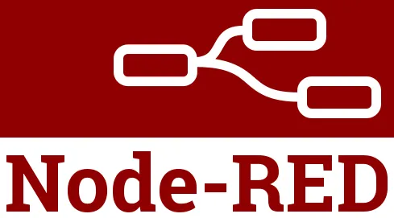
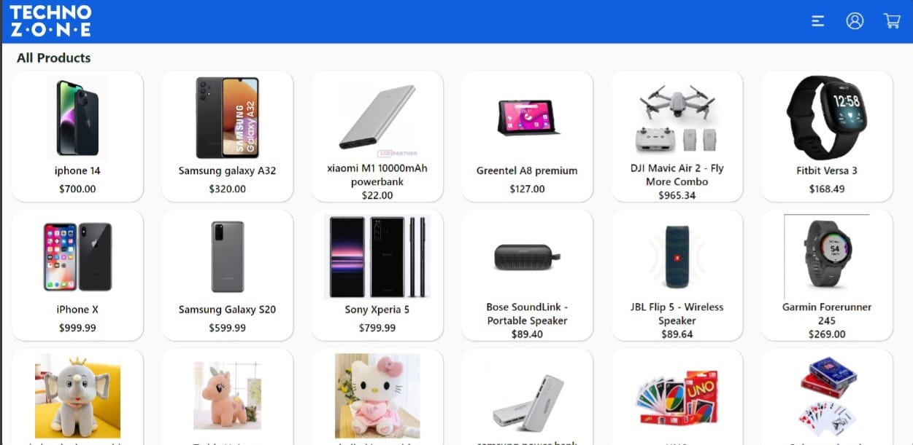

# **Madushan Suriyabandara** - Computer Science Engineering Undergrad

Hello 👋. I am a 3rd-year Computer Science and Engineering student at the University of Moratuwa.

  
Navigate

  
  1. [Technical Skills](#technical-skills)
  2. [Projects](#projects)
  3. [Contact Information](#contact-information)

## **🔧 Technical Skills**

**Programming Languages:**

**Frameworks:**

**Database Management:**

**Web Development:**

**Tools:**

## **Projects**

<table>
  <tr>
    <td width="50%" valign="top">
      <h3><a href="https://github.com/Madushansuriyabandara/Mediconnect">Real-time Medical Care Management System</a></h3>
      

        
      

      
A dual-mode mobile app for patients and doctors built using Flutter, Django, and PostgreSQL, complemented by a web app for admins using React. Key features include doctor search, appointment scheduling, real-time doctor availability updates, and prescription management with medicine reminders for patients. For doctors, the app offers task scheduling, patient attendance support, and medical session management.

      

        
        
        
        
      

    </td>
    <td width="50%" valign="top">
      <h3><a href="https://github.com/Madushansuriyabandara/Smart_Medibox">Smart Medibox</a></h3>
      

        
      

      
The Smart MediBox, featuring reminders for medication times and alerts for environmental conditions. Utilized MQTT architecture and Node-RED Dashboard for sensor data display and user control. Implemented using Wokwi, Node-RED, and designed the PCB with EasyEDA.

      

        
        
        
      

    </td>
  </tr>
  <tr>
    <td width="50%" valign="top">
      <h3><a href="https://github.com/Madushansuriyabandara/E-Commerce-Platform">E-commerce Platform</a></h3>
      

        
      

      
An E-Commerce platform with a MySQL database system for product variant management, inventory control, and online purchasing for guests and registered users. Developed mechanisms for tracking sales, product popularity, and delivery time estimations using triggers, procedures, and indexing.

      

        
        
        
        
      

    </td>
    <td width="50%" valign="top">
      <h3><a href="https://github.com/Madushansuriyabandara/RPAL_Interpreter">RPAL Interpreter</a></h3>
      

        
      

      
An RPAL interpreter, handling script execution through components like a lexical analyzer, parser, standardizer, and CSE machine. Implemented in Java to parse and execute recursive algorithms and functional constructs.

      

        
      

    </td>
  </tr>
</table>

## **Contact Information**

- **Email**: [madushansuriyabandara@gmail.com](mailto:madushansuriyabandara@gmail.com)
- **LinkedIn**: [Madushan Suriyabandara](https://www.linkedin.com/in/madushan-suriyabandara-75b322243/)
